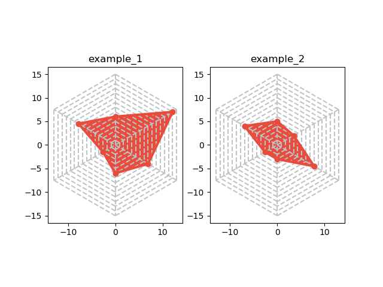
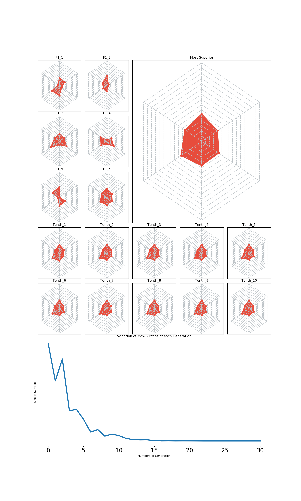
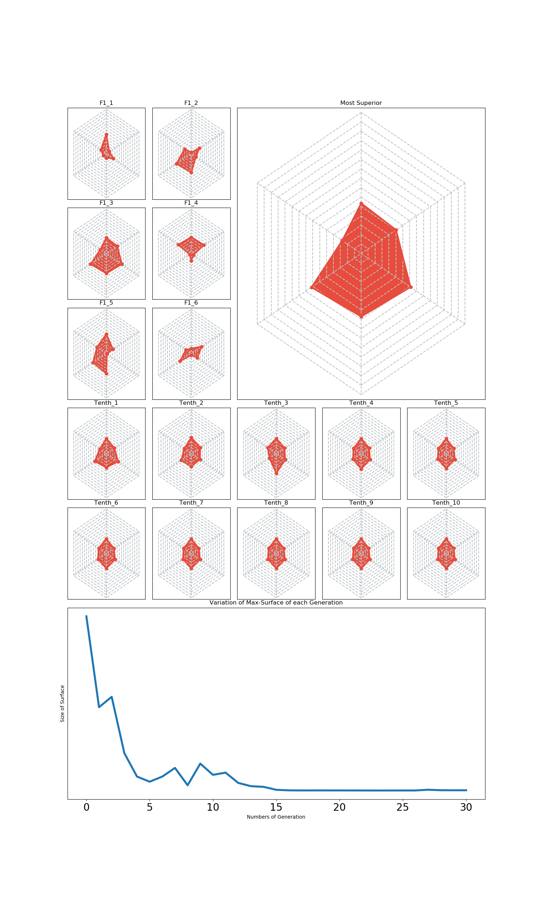
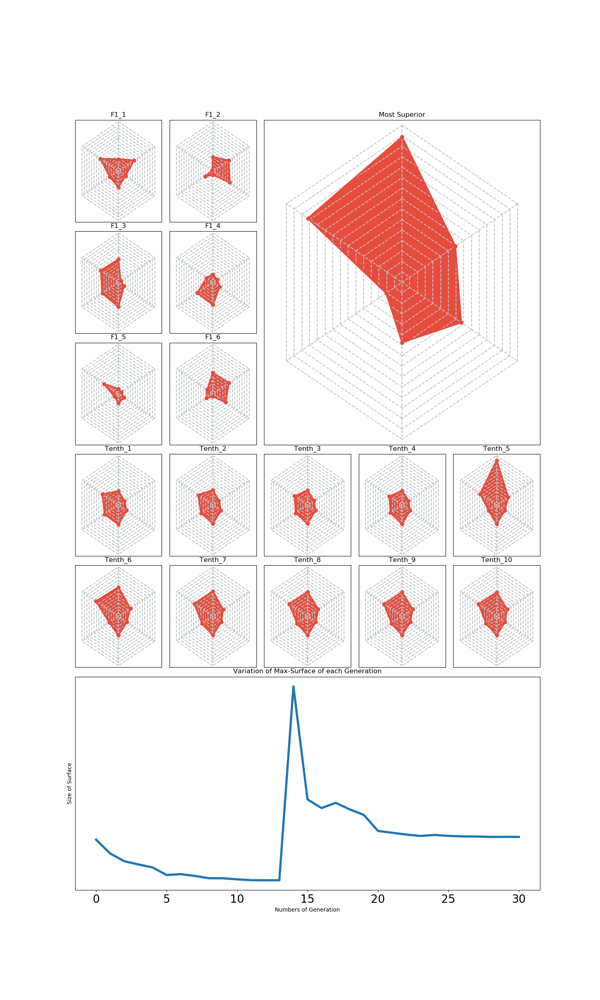
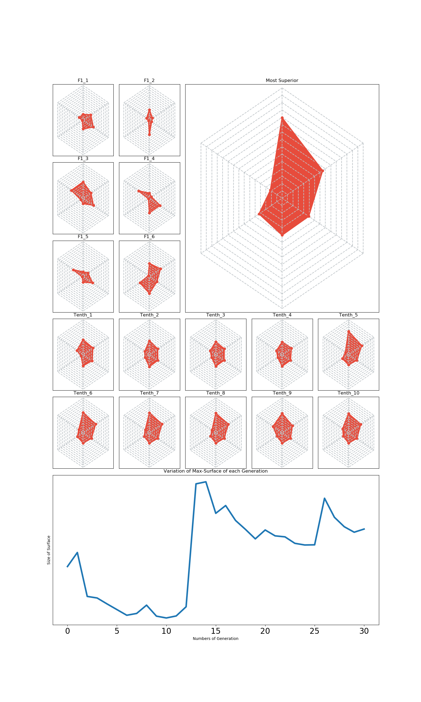

# ◉ Analysis of Inbreeding Problems through Evolutionary Algorithms

생명과학 프로젝트입니다.

### ✔ 프로젝트 개요

유전적 다양성 확보는 종의 생존과 존속에 있어 매우 중요한 요소로 작용되며 이를 저해하는 근친교배(inbreeding) 및 자가교배(self-crossing)는 각종 유전병 발생의 원인이 된다. 본 탐구에서는 시뮬레이션을 통해 자가교배 시에 나타나는 문제점을 알아보고자 한다.

### ✔ 모델 설정

- 처음에 무작위로 6마리의 개체를 생성한다.

- 개체의 생존에 관여하는 요소(이하 factor)는 6가지이며 이를 그림으로 나타내면 아래와 같다.

  </img>

  각 개체는 6개의 factor마다 1~15 중 하나의 값을 갖게 되며 두 개체를 비교할 때 그림에서의 빨간색 영역(이하 생존률)이 더 넓은 개체가 생존에 유리하다고 설정하였다.

### ✔ 교배 및 유전자 전달

- 한 세대에서의 모든 개체는 다른 개체와 모두 교배하여 자손을 만든다.(만약 4마리가 있을 경우 교배는 6번 일어난다.)

- 자손의 factor는 (부모의 factor 사이의 범위±2)에서 임의의로 결정된다.

- 생성된 모든 자손들 중에서 부모 세대의 개체수만큼의 개체를 골라낸다. 이때, 선택될 확률(생존할 확률)은 생존률에 비례한다.

- 부모 개체수만큼 선택된 자손은 다시 부모 세대가 되어 이 과정을 반복한다.

### ✔ 교차 및 돌연변이

- 유전적 다양성 증진을 위해 교차와 돌연변이가 확률적으로 일어나도록 설정하였다. 일반적인 경우 돌연변이 확률은 1/10⁶ 으로 매우 적으나 돌연변이 효과를 보기 위한 실험에서는 1%로 확률을 대폭 늘려 실험하였다.

- 교차의 경우, 임의의 두 개체의 factor가 바뀌는 것이며 바뀌는 factor의 개수는 무작위로 설정된다.

- 돌연변이의 경우, 임의의 factor를 선정한 후 그 값을 재설정하며 factor의 개수는 무작위로 설정된다.

### ✔ 탐구결과

총 30번의 교배를 거쳐 만들어진 자손 중 가장 생존률이 높은 개체를 비교하였다.

- 도태되는 경우

  </img>
  </img>

  그림에서 왼쪽 위 6개는 F1세대 즉, 최초의 개체를 나타내며 오른쪽 큰 그림은 역대 가장 생존률이 높은 개체, 아래 10는 3번의 교배마다 가장 생존률이 높은 개체를 나타내었다. 맨 아래의 그래프는 세대마다 생존률이 가장 높은 갸체의 빨간색 영역의 넓이 변화를 나타낸다.

  그래프를 통해 알 수 있듯 세대를 거듭할 수록 생존률은 지속적으로 감솧는 경향을 보이며 이는 자가교배시에 나타나는 도태와 연관지을 수 있다.

- 돌연변이가 발생한 경우

  </img>
  </img>

  돌연변이 확률을 1%로 매우 높게 설정한 뒤 실험을 진행하였다.

  그래프를 보면 도태 모델처럼 생존률이 감소하다가 중간에 급속히 상승하는 것을 관찰할 수 있다. 왼쪽 그림과 같은 큰 변화는 돌연변이 중에서도 많은 factor가 높게 변이된 것이라고 추측할 수 있다.  
  오른쪽 그림의 그래프를 보면 피크가 두 개인 것으로 보아 돌연변이가 두 번 일어났음을 알 수 있다.

### ✔ 탐구의 확장 가능성

- 유전자 풀의 다양성 증가
  본 탐구에서는 6개의 factor만으로 실험했지만 실제로 유전에 관여하는 요소가 매우 많음을 고려할 때 factor의 수를 늘린다면 더 유의미한 결과를 얻을 수 있을 것이다. 또한 부모 세대의 개체수를 늘린다면 보다 현실적인 시뮬레이션이 가능할 것이다.
